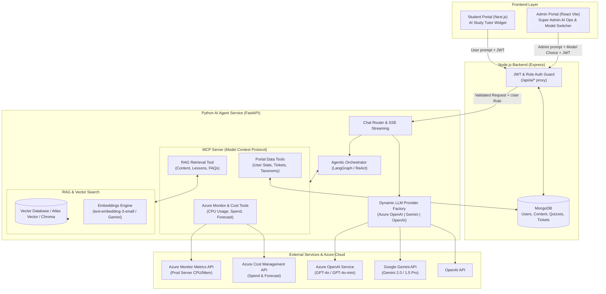

# Agentic AI Chatbot Integration Plan (LLM + RAG + MCP + Azure Ops)

## Executive Summary
This document presents the complete architectural design and step-by-step roadmap to integrate an **Agentic AI Chatbot system** across the **Osarthi Platform**. 

The architecture introduces a dedicated **Python Agent Service (`ai-agent-service`)** alongside the existing Node.js backend and React/Next.js frontends. It incorporates:
- **Dynamic Multi-LLM Engine**: Azure OpenAI as default (via `.env`), with dynamic runtime switching to Google Gemini or standard OpenAI from the portal.
- **RAG (Retrieval-Augmented Generation)**: Vector search over courses, lesson blocks, quizzes, documentation, and FAQs.
- **MCP (Model Context Protocol) Server**: Exposing tools for database lookups and Azure cloud operations.
- **Super Admin Azure Ops Assistant**: Live CPU/memory metrics, cost analysis, daily spend breakdown, and cost forecasting using Azure SDKs.
- **Portal Chat Interfaces**: Interactive AI Learning Assistant in `lumen-student-portal` and an AI Ops & Management Console in `admin-frontend`.

---

## 1. System Architecture Diagram



---

## 2. Component Specifications

### 2.1 Python AI Agent Service (`ai-agent-service/`)
A high-performance Python FastAPI service responsible for multi-turn agent conversations, reasoning loops, tool invocation, and streaming.

* **Tech Stack**: Python 3.11+, FastAPI, Uvicorn, LangGraph / LangChain, `mcp` Python SDK, `azure-identity`, `azure-mgmt-costmanagement`, `azure-mgmt-monitor`, `google-genai`, `openai`.
* **Endpoints**:
  - `POST /api/agent/chat`: Handles SSE (Server-Sent Events) streaming responses. Accepts `message`, `conversation_id`, `role`, and optional `model_preference` (`azure_openai`, `gemini`, `openai`).
  - `GET /api/agent/models`: Returns available models and current default.
  - `POST /api/rag/ingest`: Triggered when new content or lessons are published in Osarthi to update vector embeddings.

### 2.2 Dynamic LLM Provider Factory
Allows users/admins to toggle the active LLM on-demand while maintaining Azure OpenAI as the primary default from `.env`:
- **Azure OpenAI (Default)**: `AZURE_OPENAI_API_KEY`, `AZURE_OPENAI_ENDPOINT`, `AZURE_OPENAI_DEPLOYMENT_NAME`, `AZURE_OPENAI_API_VERSION`.
- **Google Gemini**: `GEMINI_API_KEY`, using `gemini-2.0-flash` or `gemini-1.5-pro`.
- **OpenAI**: `OPENAI_API_KEY`, using `gpt-4o` / `gpt-4o-mini`.

### 2.3 Model Context Protocol (MCP) Server
The MCP Server defines standardized tools that the agent calls dynamically:

1. **Azure Cloud Operations Tools** (Super Admin Only):
   - `azure_get_vm_metrics(resource_name, metric_name="Percentage CPU", timespan="PT1H")`: Fetches current and historical CPU/Memory load on production servers.
   - `azure_get_cost_summary(timeframe="MonthToDate")`: Aggregates current month-to-date cloud costs, broken down by resource groups and service names.
   - `azure_get_cost_forecast(granularity="Daily", lookahead_days=30)`: Queries Azure Cost Management forecast engine to project upcoming billing.
   - `azure_get_app_service_status()`: Checks health and uptime of Web Apps / Container Apps.

2. **Portal Domain Tools**:
   - `portal_get_student_progress(student_id)`: Fetches quiz attempts, completed topics, and scores.
   - `portal_get_platform_metrics()`: Returns active user count, open support tickets, pending teacher applications, and recent taxonomy requests.
   - `portal_search_teachers_or_courses(query)`: Searches database for matching instructors and published topics.

3. **RAG Vector Search Tools**:
   - `rag_search_curriculum(query, class_id, subject_id, top_k=5)`: Semantic search over lesson content blocks, notes, and quiz explanations.

---

## 3. RAG Pipeline Design

### Knowledge Ingestion Flow
1. **Source Data**:
   - `Content` model: Title, description, sections/blocks (rich text, HTML, highlights).
   - `Quiz` model: Questions, options, explanations.
   - `Taxonomy`: Classes, Subjects, Topics.
   - Portal FAQs & Guides: Support documentation and policies.
2. **Chunking & Embeddings**:
   - Recursive character chunking (chunk size: 600 tokens, overlap: 100 tokens).
   - Embeddings: Azure OpenAI `text-embedding-3-small` (or Gemini `text-embedding-004`).
3. **Storage & Retrieval**:
   - Vector collection in MongoDB (using MongoDB Atlas Vector Search) or ChromaDB/Azure AI Search.
   - Hybrid ranking (Vector similarity score + Keyword BM25 filtering by Subject/Class).

---

## 4. Frontend Integration Plan

### 4.1 Admin Portal (`admin-frontend`)
1. **Model Switcher & AI Status**:
   - Dropdown in `AdminHeader` or AI Drawer: Toggle between **Azure OpenAI (Default)**, **Google Gemini**, and **OpenAI**.
2. **AI Copilot Drawer / Floating Assistant**:
   - Quick-action buttons for Super Admins:
     - 📊 *"Show prod server CPU usage"*
     - 💰 *"What is current Azure cost and next 30-day forecast?"*
     - 🎫 *"Summarize pending support tickets"*
     - 👥 *"Show new teacher applications"*
   - Render structured charts/cards inside chat for Azure metrics and cost visualizations.

### 4.2 Student Portal (`lumen-student-portal`)
1. **Floating AI Tutor Widget**:
   - Bottom-right collapsible chat widget with dark/light theme matching Lumen branding.
   - Context-aware: Knows what lesson/topic the student is currently viewing (`window.location` / current page slug).
   - Instant doubt resolution, practice question generation, and concept simplifier.

---

## 5. Security & Deployment Architecture

1. **Role-Based Tool Authorization (RBAC)**:
   - Python Agent verifies user JWT token passed from the Node.js API gateway.
   - Azure Ops tools (`azure_*`) and Super Admin tools are strictly blocked unless `user.role === 'superAdmin'`.
2. **Azure Deployment**:
   - **Containerized Architecture**: Docker containers for `backend` (Node.js), `ai-agent-service` (Python FastAPI), and frontends.
   - **Azure Container Apps** or **Azure App Service (Linux)** for server hosting.
   - Managed Identity (`DefaultAzureCredential`) configured on Azure for passwordless, secure access to Azure Monitor and Cost Management APIs.

---

## 6. Implementation Phases

```
Phase 1: Python AI Agent Service Setup & LLM Factory (Azure OpenAI default + Gemini + OpenAI)
Phase 2: MCP Server & Tool Definitions (Azure Monitor, Azure Cost Management, MongoDB)
Phase 3: RAG Ingestion Pipeline (Content vector embeddings & hybrid search)
Phase 4: Node.js Backend Gateway & Auth Proxy (/api/ai/chat)
Phase 5: Admin Portal AI Ops Copilot UI & Model Selector Dropdown
Phase 6: Student Portal AI Tutor Floating Widget UI
Phase 7: End-to-End Testing & Azure Deployment Config (Docker, env setup)
```

## User Review Required
> [!IMPORTANT]
> - **Azure Credentials for Admin Ops**: For the agent to fetch CPU usage and cost forecasts, the Azure App Service / Container App will use Azure Managed Identity or an Azure Service Principal with `Cost Management Reader` and `Monitoring Reader` roles on your Azure Subscription.
> - **Vector Storage Choice**: We can use **MongoDB Atlas Vector Search** (using your existing MongoDB instance) or a dedicated vector database (**ChromaDB / Azure AI Search**). MongoDB Atlas Vector Search requires no additional infrastructure.
